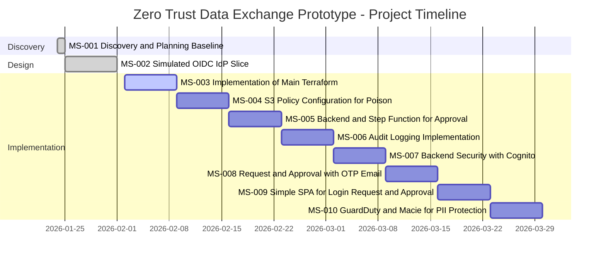

# Project Gantt Chart

This Gantt chart visualizes the project timeline across all milestones, showing the planned one-week sprint cadence.

## Milestone Summary

| Milestone | Name                                       | Type           | Duration | Start Date | Target Date | Status      |
| --------- | ------------------------------------------ | -------------- | -------- | ---------- | ----------- | ----------- |
| MS-001    | Discovery and Planning Baseline            | Discovery      | 1 day    | 2026-01-24 | 2026-01-24  | Completed   |
| MS-002    | Simulated OIDC IdP Slice                   | Design         | 7 days   | 2026-01-25 | 2026-02-01  | Completed   |
| MS-003    | Implementation of Main Terraform           | Implementation | 7 days   | 2026-02-02 | 2026-02-08  | In Progress |
| MS-004    | S3 Policy Configuration for Poison         | Configuration  | 7 days   | 2026-02-09 | 2026-02-15  | Planned     |
| MS-005    | Backend and Step Function for Approval     | Implementation | 7 days   | 2026-02-16 | 2026-02-22  | Planned     |
| MS-006    | Audit Logging Implementation               | Implementation | 7 days   | 2026-02-23 | 2026-03-01  | Planned     |
| MS-007    | Backend Security with Cognito              | Implementation | 7 days   | 2026-03-02 | 2026-03-08  | Planned     |
| MS-008    | Request and Approval with OTP Email        | Implementation | 7 days   | 2026-03-09 | 2026-03-15  | Planned     |
| MS-009    | Simple SPA for Login, Request and Approval | Implementation | 7 days   | 2026-03-16 | 2026-03-22  | Planned     |
| MS-010    | GuardDuty and Macie for PII Protection     | Implementation | 7 days   | 2026-03-23 | 2026-03-29  | Planned     |

## Key Dates

- **Project Start**: January 24, 2026
- **Current Milestone**: MS-003 (In Progress)
- **Projected Completion**: March 29, 2026
- **Total Duration**: ~10 weeks (1 discovery day + 9 week-long sprints)
